# 📝 TodoMate: Teman Pintar Manajemen Tugas Anda

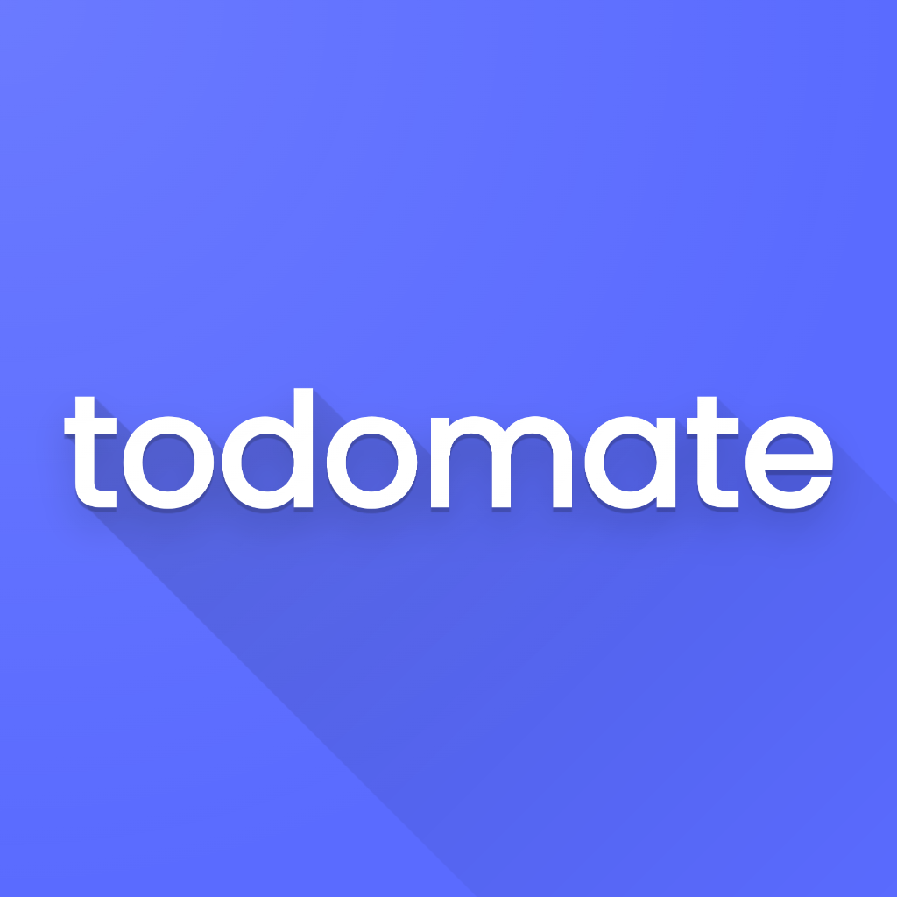

**📝 TodoMate** adalah aplikasi Flutter inovatif yang dirancang untuk merevolusi produktivitas pribadi dan manajemen tugas. Dibangun dengan antarmuka yang bersih dan intuitif, TodoMate memanfaatkan kemampuan modern Flutter untuk memberikan pengalaman yang mulus dalam mengorganisir tugas harian, melacak progres, dan mempertahankan fokus melalui alat produktivitas terintegrasi.

📱✅ Didukung oleh framework Flutter yang kuat, TodoMate menghadirkan antarmuka pengguna yang indah dan responsif yang membuat manajemen tugas menjadi mudah. Baik itu membuat to-do cepat, menjadwalkan tenggat waktu penting, atau tetap fokus dengan timer Pomodoro bawaan, TodoMate menyediakan semua yang Anda butuhkan untuk tetap produktif dan terorganisir.

🔧🏗️ Dirancang untuk skalabilitas dan performa, TodoMate dibangun di atas fondasi yang kokoh yang memastikan persistensi data, animasi yang mulus, dan manajemen state yang efisien. Arsitektur modular aplikasi ini memungkinkan pemeliharaan yang mudah dan peningkatan fitur di masa depan, menjadikan TodoMate sebagai pendamping yang andal untuk produktivitas jangka panjang.

  
  
  
  

  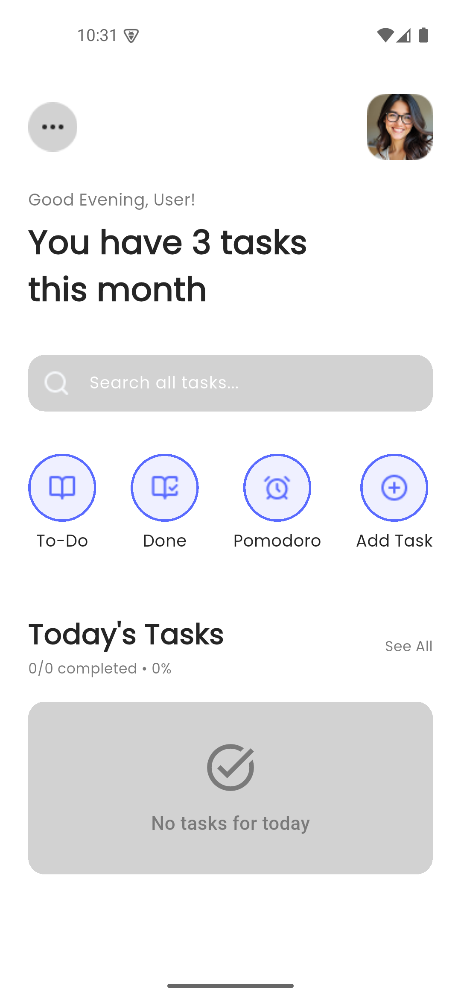
  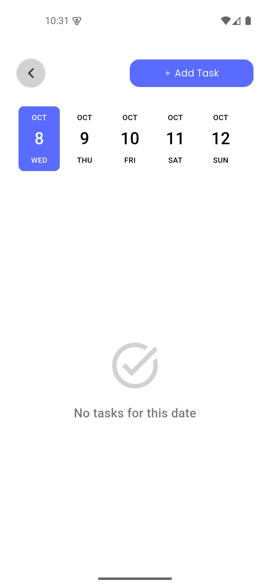
  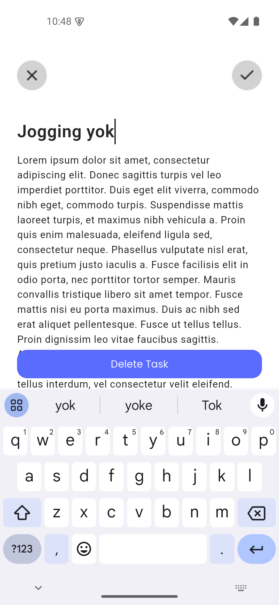
  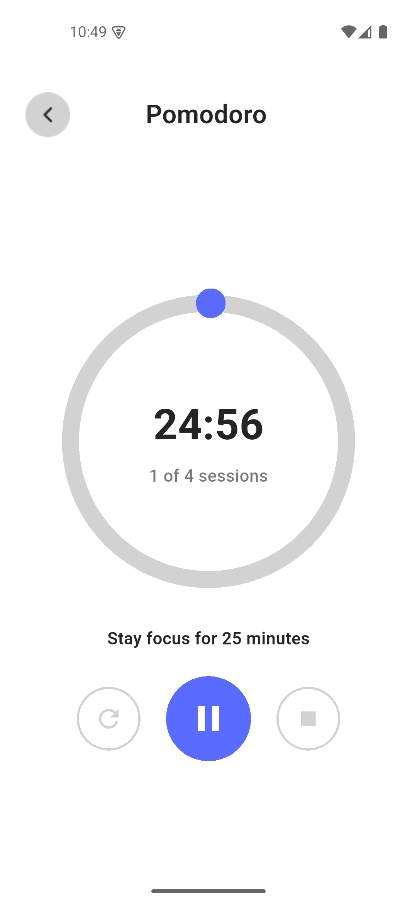
  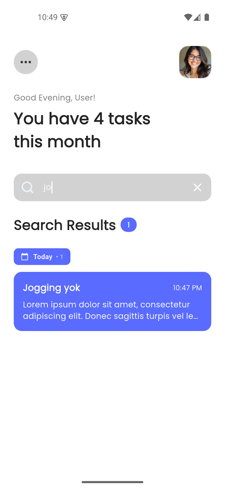

## ⚠️ Penafian

**TodoMate** adalah **proyek edukatif dan portofolio** yang dirancang untuk mendemonstrasikan praktik pengembangan Flutter modern dan prinsip arsitektur bersih. Tujuan utama dari proyek ini adalah untuk menampilkan fungsionalitas manajemen tugas, manajemen state, persistensi data, dan desain antarmuka pengguna menggunakan **framework Flutter**.

Nama **"TodoMate"** dan desainnya dibuat sebagai bagian dari **proyek portofolio pengembangan mobile**, dan kesamaan dengan merek, layanan, atau aplikasi yang sudah ada adalah murni kebetulan.

Proyek ini dibangun untuk **tujuan pembelajaran**, **demonstrasi keterampilan**, dan **penampilan portofolio**. Ini mendemonstrasikan kemahiran dalam pengembangan Flutter, manajemen data lokal, desain UI/UX, dan arsitektur aplikasi.

## Fitur Utama:

- **✅ Manajemen Tugas:** Buat, edit, hapus, dan organisir tugas dengan mudah. Setiap tugas mencakup judul, deskripsi, tanggal, dan waktu untuk perencanaan yang komprehensif.

- **📅 Integrasi Kalender:** Date picker intuitif dengan antarmuka kalender yang indah memungkinkan pengguna untuk menjadwalkan tugas secara efisien dan melihat tugas berdasarkan tanggal tertentu.

- **🔍 Pencarian Cerdas:** Fungsionalitas pencarian yang kuat bekerja di semua tugas, mencari melalui judul dan deskripsi untuk membantu Anda menemukan yang Anda butuhkan secara instan.

- **📊 Pelacakan Progress:** Indikator progres visual menunjukkan status penyelesaian tugas dengan progress bar dinamis dan tampilan persentase.

- **⏰ Timer Pomodoro:** Timer teknik Pomodoro bawaan membantu mempertahankan fokus dan produktivitas dengan interval kerja dan istirahat yang dapat disesuaikan.

- **💾 Persistensi Data:** Penyimpanan lokal yang andal menggunakan SharedPreferences memastikan tugas Anda tersimpan dengan aman dan dapat diakses bahkan setelah menutup aplikasi.

- **🎨 UI/UX yang Indah:** Antarmuka modern dan bersih dengan animasi yang mulus, widget kustom, dan navigasi intuitif untuk pengalaman pengguna yang menyenangkan.

- **🌓 Dukungan Mode Gelap:** Tema gelap yang ramah mata di seluruh aplikasi untuk penggunaan yang nyaman dalam kondisi pencahayaan apa pun.

- **📱 Desain Responsif:** Dioptimalkan untuk berbagai ukuran layar memastikan pengalaman yang konsisten di berbagai perangkat.

- **⚡ Performa Cepat:** Manajemen state yang efisien dan rendering yang dioptimalkan memastikan scrolling yang mulus dan respons yang instan.

## Teknologi yang Digunakan:

- **📱 Flutter (Framework UI)**

- **🎨 Widget Kustom (Komponen yang Dapat Digunakan Kembali)**

- **💾 SharedPreferences (Penyimpanan Data Lokal)**

- **📅 Date Picker Timeline (Widget Kalender)**

- **🕐 Intl (Format Tanggal dan Waktu)**

TodoMate menawarkan perpaduan sempurna antara fungsionalitas, estetika, dan performa, menghadirkan solusi manajemen tugas yang komprehensif yang membantu pengguna tetap terorganisir dan produktif.

  
  

## Mengapa Flutter dan Penyimpanan Lokal untuk TodoMate? 🔍

TodoMate memilih Flutter dan SharedPreferences karena beberapa alasan inti yang meningkatkan pengalaman pengguna dan pengembangan aplikasi:

### Flutter untuk UI yang Indah dan Berperforma:

- **🚀 Animasi mulus:** Flutter memungkinkan pembuatan animasi dan transisi yang indah dan halus, memastikan pengalaman pengguna yang menarik di TodoMate.

- **📱 Pengembangan lintas platform:** Dengan Flutter, TodoMate dapat berjalan dengan mulus di Android dan iOS menggunakan satu basis kode, memaksimalkan efisiensi pengembangan.

- **🎨 Desain pixel-perfect:** Perpustakaan widget Flutter yang ekstensif memungkinkan kustomisasi yang presisi dan desain yang konsisten di seluruh aplikasi.

- **⚡ Hot reload:** Umpan balik instan selama pengembangan mempercepat proses iterasi dan meningkatkan kualitas kode.

### SharedPreferences untuk Manajemen Data yang Andal:

- **💾 Penyimpanan lokal yang cepat:** SharedPreferences menyediakan penyimpanan yang cepat dan efisien untuk data tugas, memastikan akses dan pembaruan yang instan.

- **🔒 Fokus pada privasi:** Semua data tetap berada di perangkat pengguna, memberikan privasi lengkap dan fungsionalitas offline.

- **🎯 Integrasi sederhana:** API yang mudah digunakan membuat persistensi data menjadi langsung dan andal.

- **📦 Solusi ringan:** Tidak memerlukan pengaturan database yang kompleks, menjaga ukuran aplikasi tetap kecil dan performa optimal.

Dengan memanfaatkan Flutter dan SharedPreferences, TodoMate memanfaatkan manajemen data lokal yang efisien dan desain UI yang indah, menawarkan pengalaman manajemen tugas yang cepat, andal, dan berfokus pada privasi kepada pengguna.

## Keuntungan Clean Architecture di TodoMate 🏗️

### Clean Architecture untuk Ketahanan dan Pemeliharaan:

- **🧱 Basis kode terstruktur:** TodoMate menerapkan arsitektur modular yang terorganisir dengan baik dengan pemisahan yang jelas antara model, layanan, halaman, dan widget.

- **📦 Komponen independen:** Setiap lapisan (UI, Business Logic, Data) bersifat independen, membuat pengujian dan pemeliharaan menjadi mudah.

- **🎯 Tanggung jawab yang jelas:** Setiap kelas dan file memiliki tujuan tunggal yang terdefinisi dengan baik, meningkatkan keterbacaan dan pemeliharaan kode.

### Arsitektur Berbasis Widget untuk Reusabilitas:

- **🔗 Widget kustom yang dapat digunakan kembali:** TodoMate menampilkan widget yang dibangun khusus seperti `CustomCard`, `CustomButton`, dan `CustomCategory` yang dapat digunakan kembali di seluruh aplikasi.

- **🛣️ Navigasi yang efisien:** Sistem routing yang terstruktur dengan baik memungkinkan transisi yang mulus antara berbagai layar.

- **🧩 Isolasi komponen:** Setiap widget bersifat mandiri, membuatnya mudah untuk diperbarui atau diganti tanpa mempengaruhi bagian lain dari aplikasi.

### Layer Service untuk Business Logic:

- **⚙️ Manajemen data terpusat:** `StorageService` menangani semua operasi data, menjaga business logic terpisah dari kode UI.

- **🔍 Pengujian yang mudah:** Layer service dapat diuji secara independen, memastikan keandalan fungsionalitas inti.

- **📈 Skalabilitas:** Menambahkan fitur baru atau sumber data baru menjadi mudah dengan arsitektur saat ini.

### Pengalaman Pengembangan yang Ditingkatkan:

- **⚡ Iterasi lebih cepat:** Pemisahan perhatian yang bersih memungkinkan pembaruan cepat dan penambahan fitur tanpa merusak fungsionalitas yang ada.

- **🔍 Debugging yang lebih baik:** Struktur kode yang jelas membuatnya lebih mudah untuk mengidentifikasi dan memperbaiki masalah.

- **📚 Onboarding yang mudah:** Developer baru dapat dengan cepat memahami struktur basis kode dan berkontribusi secara efektif.

Dengan menerapkan prinsip clean architecture, TodoMate memastikan basis kode yang dapat dipelihara, dapat diskalakan, dan dapat diuji yang memfasilitasi perbaikan berkelanjutan dan peningkatan fitur.

## Tangkapan Layar Aplikasi

Berikut adalah beberapa tangkapan layar dari aplikasi kami untuk memberikan Anda gambaran tentang desain dan fungsionalitasnya.

### Layar Beranda

🏠 Selamat datang di TodoMate! Layar beranda memberikan gambaran komprehensif tentang tugas Anda, dengan akses cepat ke semua fitur dan salam indah berdasarkan waktu dalam sehari.

🔍 Pencarian yang kuat di semua tugas Anda! Temukan yang Anda butuhkan secara instan dengan mencari melalui judul dan deskripsi, dengan hasil yang dikelompokkan berdasarkan tanggal untuk navigasi yang mudah.

  
  &nbsp;&nbsp;&nbsp;
  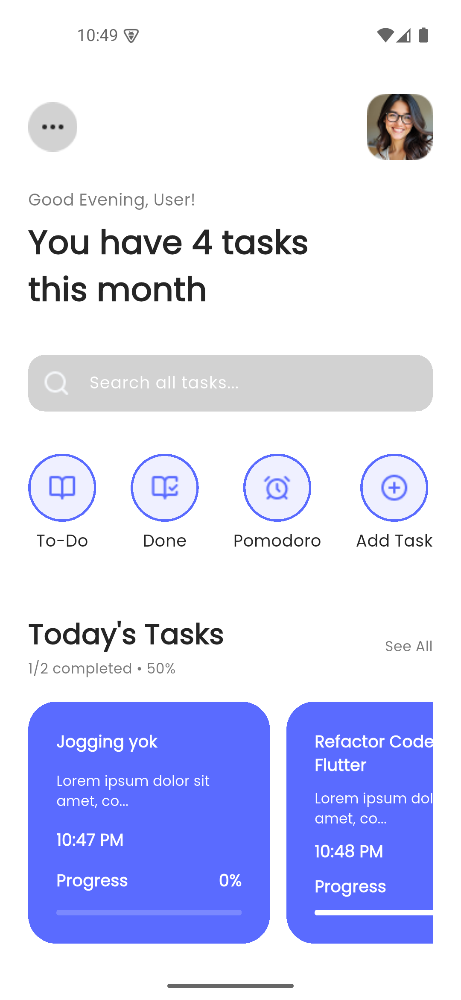
  &nbsp;&nbsp;&nbsp;
  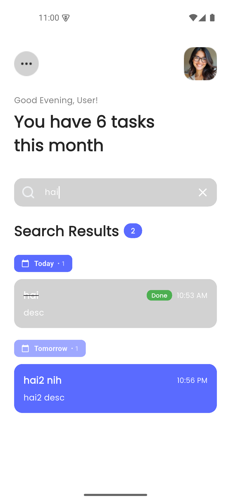

### Manajemen Tugas

✅ Buat, lihat, dan kelola tugas Anda dengan mudah! Daftar tugas intuitif dengan indikator progres visual menjaga Anda tetap pada jalur sepanjang hari.

  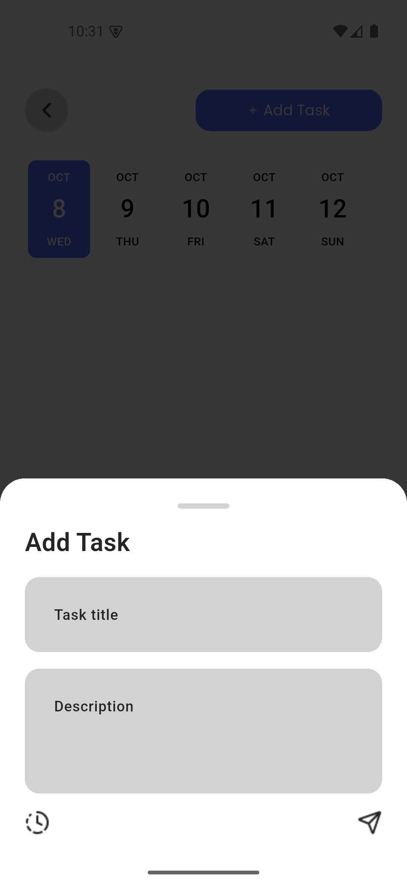
  &nbsp;&nbsp;&nbsp;
  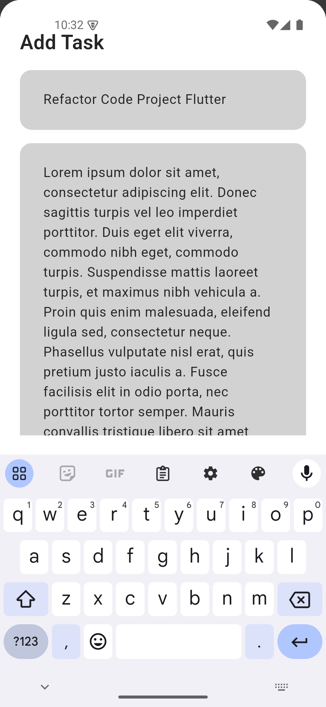
  &nbsp;&nbsp;&nbsp;
  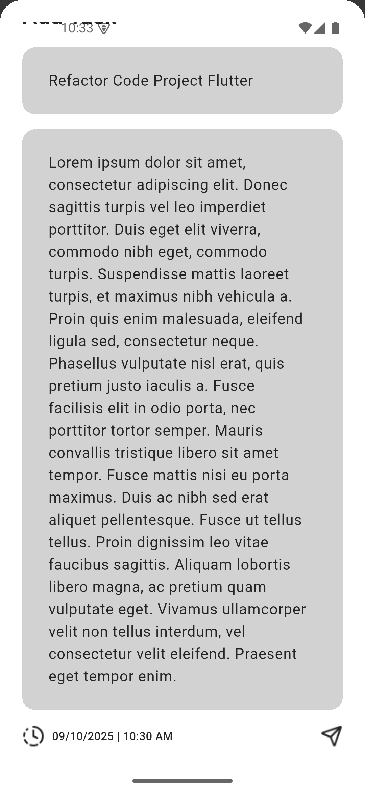

### Kalender & Pemilih Tanggal

📅 Antarmuka kalender yang indah untuk penjadwalan! Pilih tanggal dan waktu dengan dialog kalender kustom yang intuitif yang membuat perencanaan menjadi mudah.

  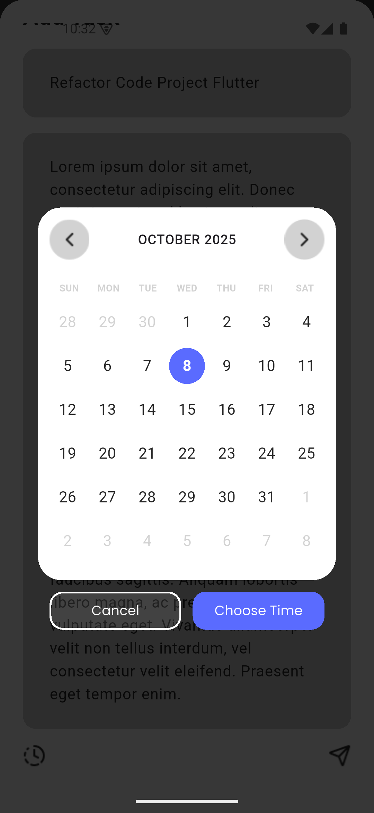
  &nbsp;&nbsp;&nbsp;
  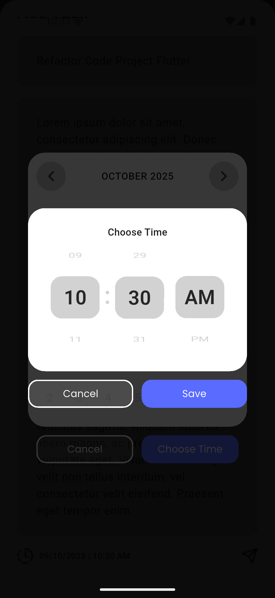
  &nbsp;&nbsp;&nbsp;

### Edit Tugas

✏️ Edit tugas Anda dengan mudah! Modifikasi detail tugas, perbarui tanggal dan waktu, atau hapus tugas yang tidak lagi Anda butuhkan - semua dalam satu layar yang nyaman.

  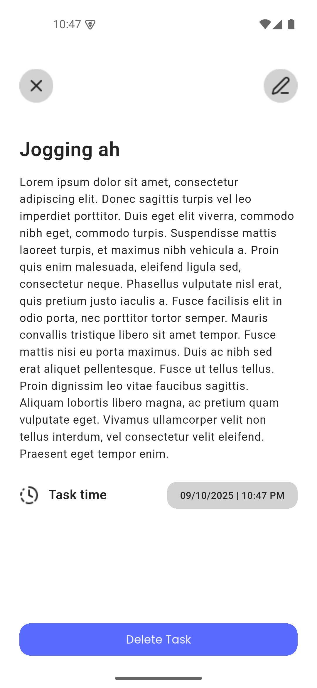
  &nbsp;&nbsp;&nbsp;
  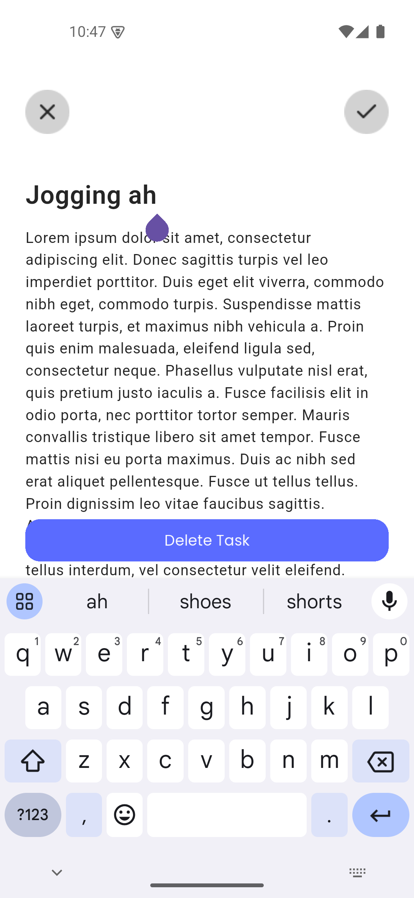
  &nbsp;&nbsp;&nbsp;

### Timer Pomodoro

⏰ Tetap fokus dengan timer Pomodoro bawaan! Sesuaikan interval kerja dan istirahat untuk memaksimalkan produktivitas Anda dan menjaga kebiasaan kerja yang sehat.

  
  &nbsp;&nbsp;&nbsp;

